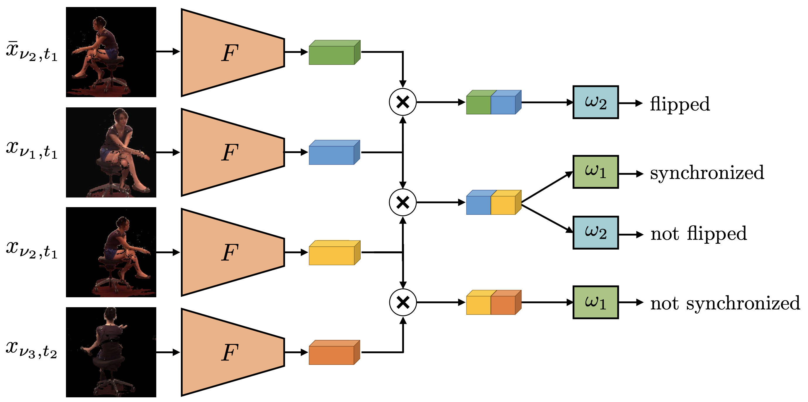

  <a href="https://sjenni.github.io" style="font-size: 21px; text-decoration: none">Simon Jenni</a> 
    &nbsp; &nbsp; &nbsp; &nbsp; &nbsp; &nbsp; &nbsp;  
  <a href="http://www.cvg.unibe.ch/people/favaro" style="font-size: 21px; text-decoration: none">Paolo Favaro</a>

  <a href="" style="font-size: 21px; text-decoration: none">[Arxiv (coming soon)]</a>
  &nbsp; &nbsp; &nbsp; &nbsp; &nbsp; &nbsp; &nbsp;  
  <a href="https://github.com/sjenni/temporal-ssl" style="font-size: 21px; text-decoration: none">[GitHub]</a> 

    

***Training a CNN to recognize synchronized views.*** *We train a network F to learn image representations that transfer well to 3D pose estimation by learning to recognize if two views of the same scene are synchronized and/or flipped. Our model uses a Siamese architecture. The inputs are  pairs of frames  of the same scene under different views. Frames are denoted by x, where the subscripts indicate the viewpoint and the time (flipped frames are indicated with a bar). Pairs are classified into whether the frames are synchronized or not synchronized, and whether one of the frames was flipped or not.*

___

# Abstract

Current state-of-the-art methods cast monocular 3D humanpose  estimation  as  a  learning  problem  by  training  neural  networks  on large  data  sets  of  images  and  corresponding  skeleton  poses.  In  contrast,  we  propose  an  approach  that  can  exploit  small  annotated  datasets by fine-tuning networks pre-trained via self-supervised learning on (large) unlabeled data sets. To drive such networks towards supporting 3D pose estimation during the pre-training step, we introduce a novel self-supervised feature learning task designed to focus on the 3D structure in an image. We exploit images extracted from videos captured with a multi-view camera system. The task is to classify whether two images depict  two  views  of  the  same  scene  up  to  a  rigid  transformation.  In  a multi-view data set, where objects deform in a non-rigid manner, a rigid transformation occurs only between two views taken at the exact same time, i.e., when they are synchronized. We demonstrate the effectiveness of  the  synchronization  task  on  the  Human3.6M  data  set  and  achieve state-of-the-art results in 3D human pose estimation.